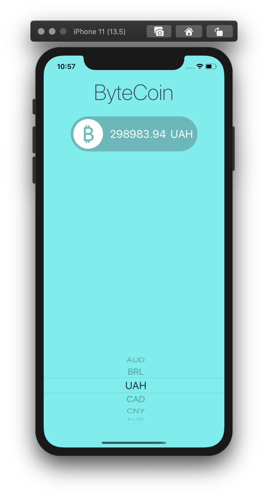

#  ByteCoin

Simple App using Coinapi.io to show ByteCoin rates

## Learned
 
* Learn about the delegate pattern.
* Swift protocols and extensions. 
* Learn to use URLSession to network and make HTTP requests.
* Parse JSON with the native Encodable and Decodable protocols. 
* Learn to use Grand Central Dispatch to fetch the main thread.

