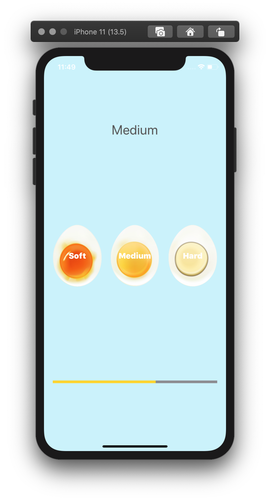

# Egg Timer

Egg timer app to boil your eggs to perfection depending on how you prefer your eggs. 

## Learned

* Swift Collection types - Dictionaries
* The Swift Timer API
* Conditional statements - IF/ELSE
* Conditional statements - Switch
* Functions with outputs
* How to use the ProgressView

